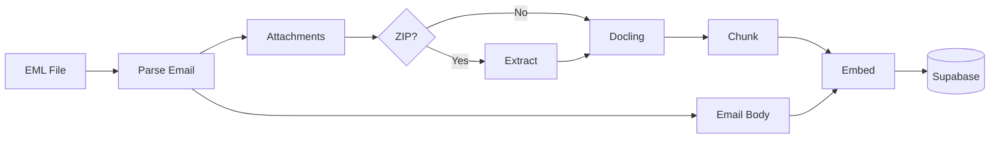

# NCL Documentation

Welcome to the NCL documentation. NCL is an Email RAG Pipeline for processing EML files with attachments, preserving document hierarchy for context-aware question answering with source attribution.

## Documentation Index

| Document | Description |
|----------|-------------|
| [Processing Flow](processing-flow.md) | Visual flowcharts of the data pipeline using Mermaid diagrams |
| [Architecture](architecture.md) | Technical architecture, components, database schema, and technology stack |
| [Features](features.md) | Comprehensive feature guide with CLI usage examples |

## Quick Links

### Getting Started

1. Copy `.env.template` to `.env` and configure your credentials
2. Run database migrations in Supabase
3. Ingest your emails: `ncl ingest --source ./emails`
4. Query the system: `ncl query "What was discussed about X?"`

### Key Features

- **Email Parsing:** Conversation-aware parsing with participant tracking
- **Multi-Format Support:** PDF, Office docs, images, HTML, ZIP archives
- **Image Understanding:** AI-powered image descriptions with SmolVLM
- **Semantic Chunking:** Structure-preserving chunks with heading paths
- **Two-Stage Retrieval:** Vector search + cross-encoder reranking
- **Source Attribution:** Every answer traces back to source documents

### Architecture Overview

```
┌─────────────┐     ┌─────────────┐     ┌─────────────┐
│   Parsing   │────>│  Processing │────>│   Storage   │
│             │     │             │     │             │
│ - EML       │     │ - Chunking  │     │ - Supabase  │
│ - Docling   │     │ - Embedding │     │ - pgvector  │
│ - ZIP       │     │ - Reranking │     │             │
└─────────────┘     └─────────────┘     └─────────────┘
                           │
                           v
                    ┌─────────────┐
                    │    Query    │
                    │             │
                    │ - Search    │
                    │ - LLM       │
                    │ - Sources   │
                    └─────────────┘
```

## Diagrams

The [Processing Flow](processing-flow.md) document contains Mermaid diagrams that can be rendered in:

- GitHub (native support)
- VS Code with Mermaid extension
- Any Mermaid-compatible Markdown viewer

### Sample Diagram Preview


