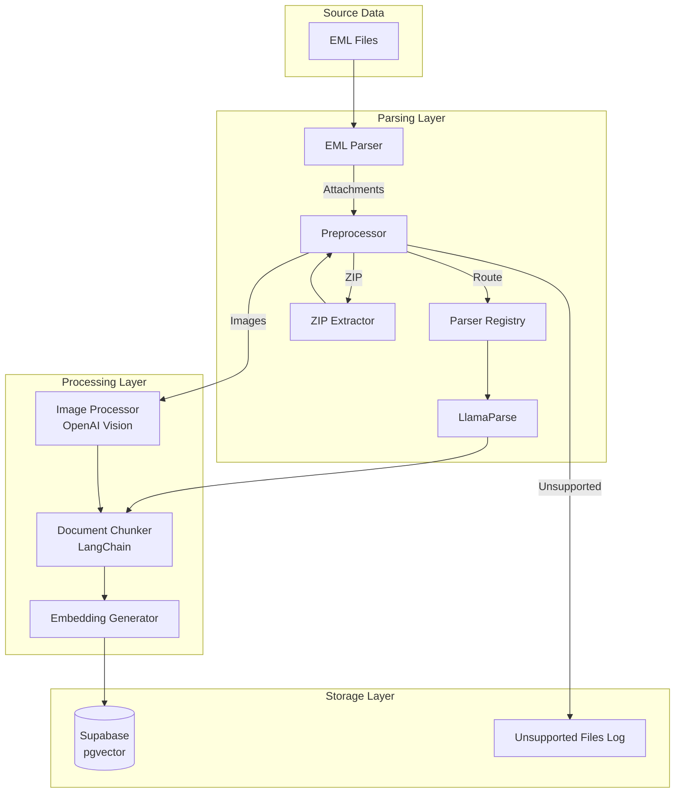
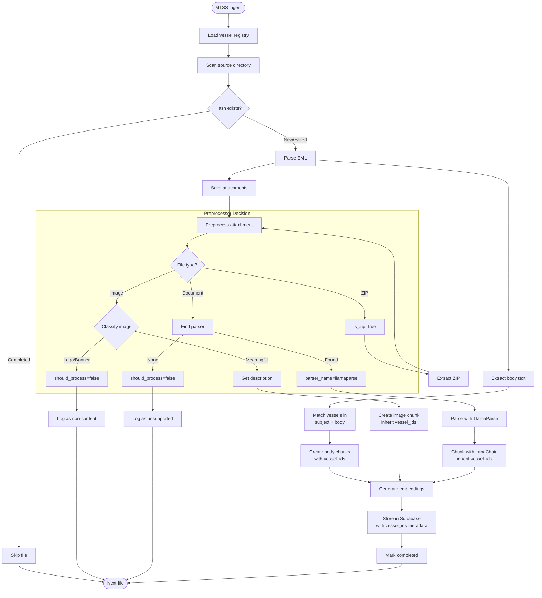
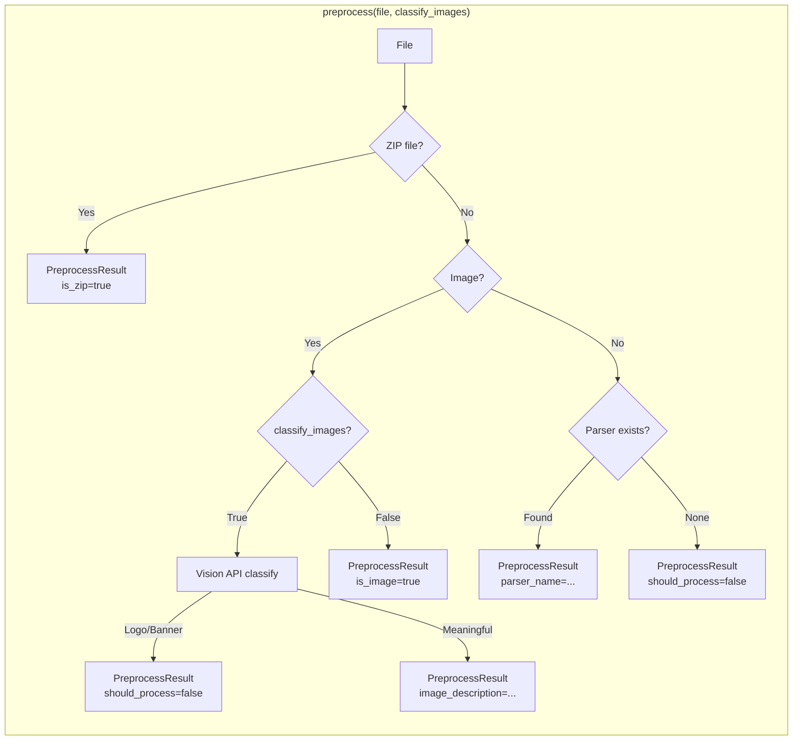
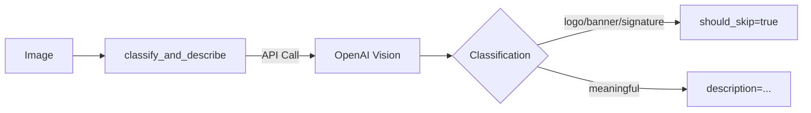
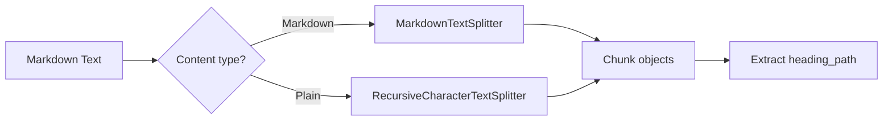
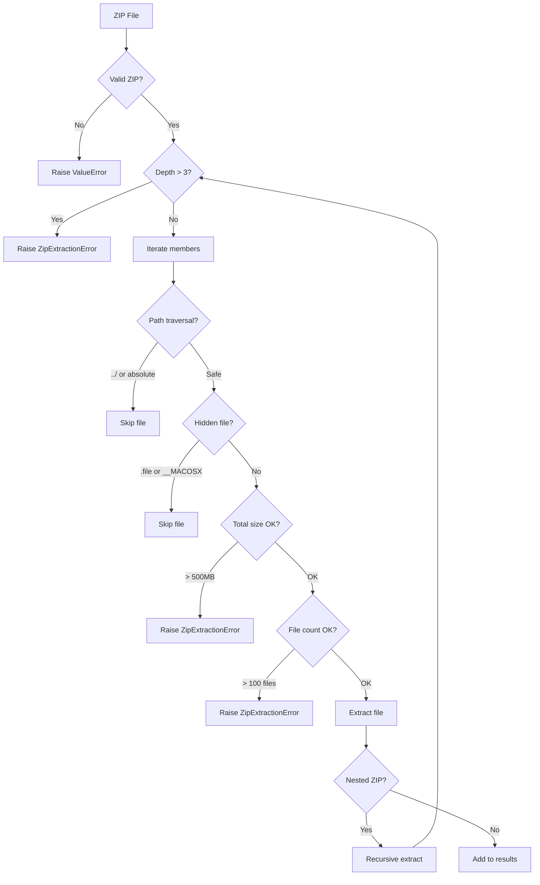
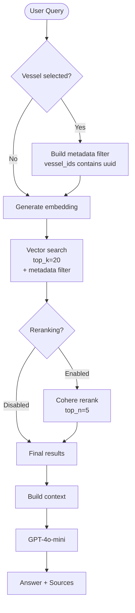
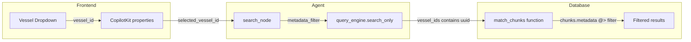

# MTSS Processing Flow

This document describes the data flow through the MTSS email RAG pipeline.

## Data Folder Structure

```
data/
├── source/                    # User-provided data (read-only)
│   ├── inbox/                 # Users can organize by folder
│   │   └── project-x/
│   │       └── email1.eml
│   ├── archive/
│   │   └── 2024/
│   │       └── email2.eml
│   └── email3.eml            # Or flat structure
│
└── processed/                 # MTSS-generated data
    ├── attachments/           # Extracted email attachments
    │   └── {email_hash}/
    │       ├── document.pdf
    │       └── image.png
    └── extracted/             # Extracted ZIP contents
        └── {zip_hash}_extracted/
            ├── file1.pdf
            └── nested_folder/
                └── file2.docx
```

## High-Level Architecture



## Ingest Pipeline Flow



## Component Responsibilities

### Preprocessor (`DocumentPreprocessor`)

Routes files to appropriate handlers and filters non-content images.



### Parser Registry (`ParserRegistry`)

Simple lookup for file type → parser mapping.

| MIME Type / Extension | Parser |
|-----------------------|--------|
| `application/pdf`, `.pdf` | LlamaParse |
| `application/vnd.openxmlformats-*`, `.docx`, `.pptx`, `.xlsx` | LlamaParse |
| `application/msword`, `.doc`, `.xls`, `.ppt` | LlamaParse |
| `text/csv`, `.csv` | LlamaParse |
| `application/rtf`, `.rtf` | LlamaParse |
| `text/html`, `.html` | LlamaParse |
| `application/epub+zip`, `.epub` | LlamaParse |

### Image Processor (`ImageProcessor`)

Uses OpenAI Vision API for:
1. **Classification**: Detect logos, banners, signatures (skip these)
2. **Description**: Generate text description of meaningful images



### Document Chunker (`DocumentChunker`)

Uses LangChain text splitters with tiktoken tokenization.



Configuration:
- `chunk_size_tokens`: 512 (default)
- `chunk_overlap_tokens`: 50 (default)
- Encoding: `cl100k_base` (matches OpenAI embeddings)

## ZIP Extraction Security



Limits (configurable via environment):
- `ZIP_MAX_DEPTH`: 3
- `ZIP_MAX_FILES`: 100
- `ZIP_MAX_TOTAL_SIZE_MB`: 500

## Query Flow



### Vessel Filtering

When a user selects a vessel in the UI, the search is filtered to only return chunks from documents tagged with that vessel.



**Tagging scope:** Only email subject and body are scanned for vessel names during ingest. Attachments inherit vessel tags from their parent email. See [features.md](features.md#11-vessel-filtering) for details.

## Data Flow Summary

| Stage | Component | Input | Output |
|-------|-----------|-------|--------|
| 1. Load | VesselMatcher | Vessel registry | Name/alias lookup |
| 2. Scan | CLI | Source directory | EML file list |
| 3. Dedupe | ProgressTracker | File hash | Skip or process |
| 4. Parse | EMLParser | EML file | Body + attachments |
| 5. Match | VesselMatcher | Subject + body | vessel_ids list |
| 6. Route | Preprocessor | File + MIME type | PreprocessResult |
| 7. Extract | AttachmentProcessor | ZIP file | Extracted files |
| 8. Classify | ImageProcessor | Image file | Skip or description |
| 9. Parse | LlamaParse | Document | Markdown text |
| 10. Chunk | DocumentChunker | Markdown | Chunk objects |
| 11. Embed | EmbeddingGenerator | Chunks | 1536-dim vectors |
| 12. Store | SupabaseClient | Chunks + vessel_ids | Database records |

## Database Schema

| Table | Purpose |
|-------|---------|
| `documents` | Email/attachment hierarchy with deduplication |
| `chunks` | Text chunks with embeddings (pgvector), vessel_ids in metadata |
| `vessels` | Vessel registry (name, IMO, type, aliases) |
| `conversations` | Chat conversations with vessel_id filter |
| `unsupported_files` | Logged unsupported/skipped files |
| `processing_log` | Progress tracking for resume |
