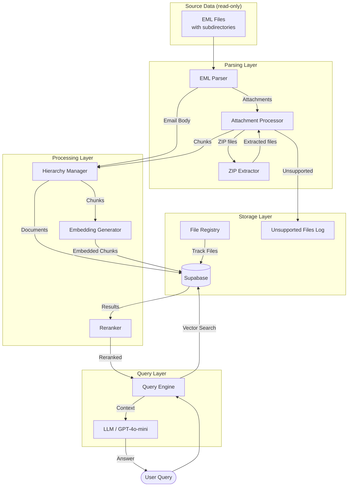
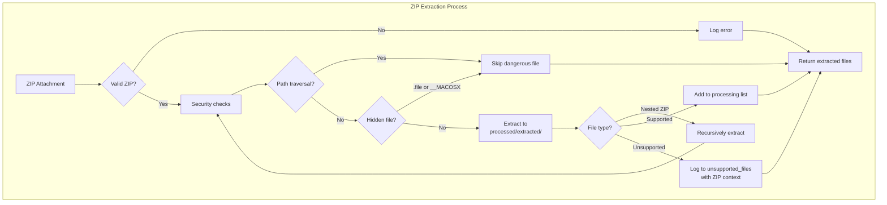
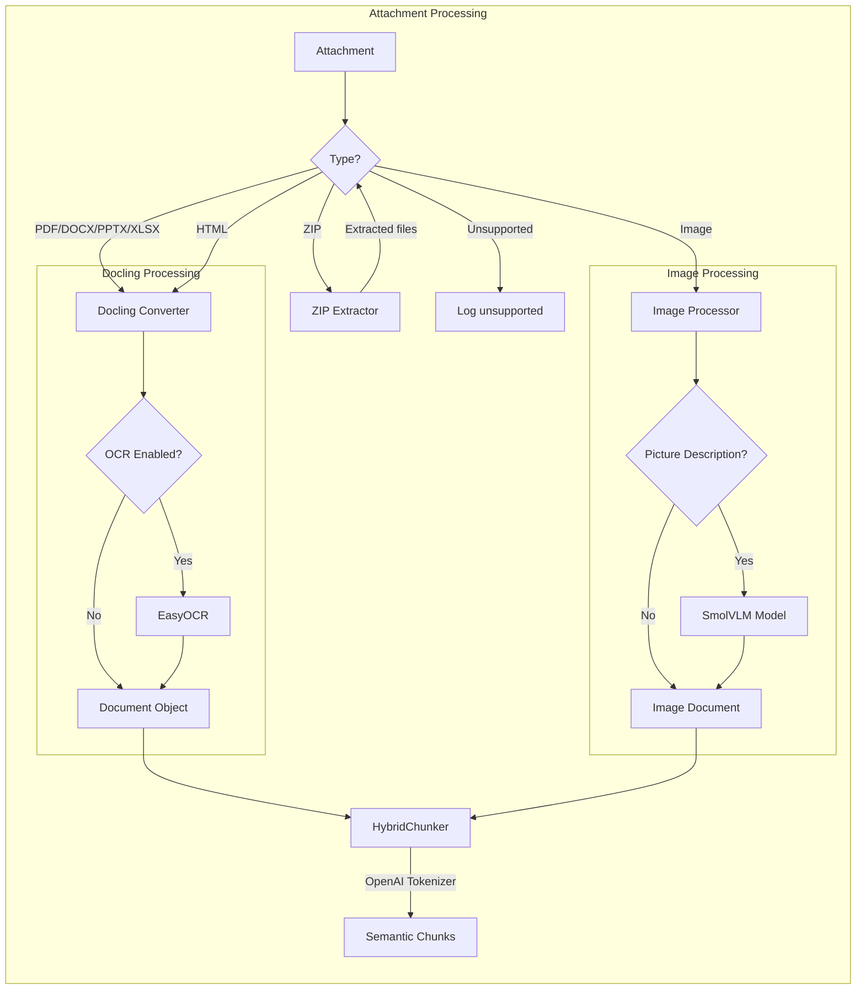
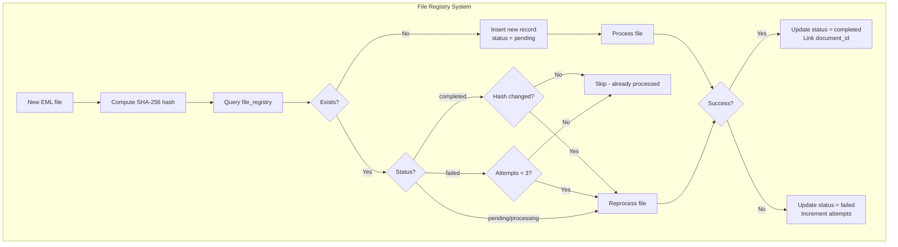
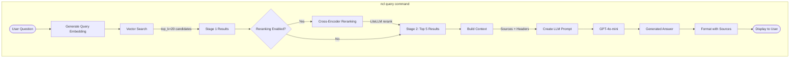
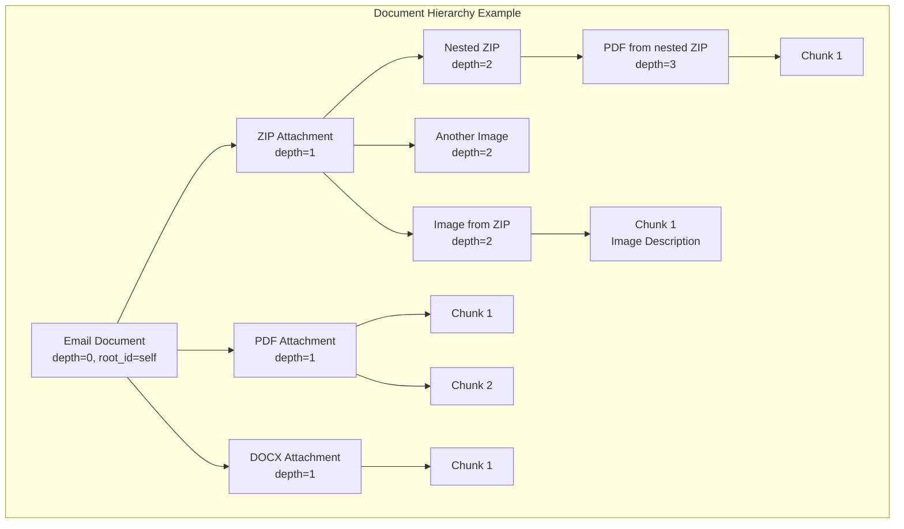
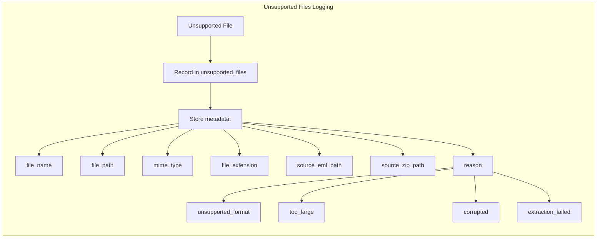

# NCL Processing Flow

This document describes the data flow through the NCL email RAG pipeline.

## Data Folder Structure

```
data/
├── source/                    # User-provided data (read-only)
│   ├── inbox/                 # Users can organize by folder
│   │   └── project-x/
│   │       └── email1.eml
│   ├── archive/
│   │   └── 2024/
│   │       └── email2.eml
│   └── email3.eml            # Or flat structure
│
└── processed/                 # NCL-generated data
    ├── attachments/           # Extracted email attachments
    │   └── {email_hash}/
    │       ├── document.pdf
    │       └── image.png
    └── extracted/             # Extracted ZIP contents
        └── {zip_hash}_extracted/
            ├── file1.pdf
            └── nested_folder/
                └── file2.docx
```

## High-Level Overview



## Detailed Ingestion Flow

```mermaid
flowchart TD
    subgraph Ingest["ncl ingest command"]
        START([Start]) --> SCAN[Scan source directory<br/>including subdirectories]
        SCAN --> REGISTRY{In file registry?}

        REGISTRY --> |Hash match + completed| SKIP[Skip file]
        REGISTRY --> |New or changed| REGISTER[Register in file_registry]

        REGISTER --> PARSE[Parse EML]

        PARSE --> BODY[Extract email body]
        PARSE --> ATTACH[Extract attachments<br/>to processed/attachments/]

        BODY --> CHUNK1[Create body chunk]

        ATTACH --> ZIPCHECK{Is ZIP file?}
        ZIPCHECK --> |Yes| EXTRACT[Extract to<br/>processed/extracted/]
        EXTRACT --> NESTED{Nested ZIP?}
        NESTED --> |Yes| EXTRACT
        NESTED --> |No| CHECKEXT[Check extracted files]

        ZIPCHECK --> |No| SUPPORTED{Supported format?}
        CHECKEXT --> SUPPORTED

        SUPPORTED --> |Yes| PROCESS[Process with Docling]
        SUPPORTED --> |No| LOGUNSUP[Log to unsupported_files]

        LOGUNSUP --> NEXTATT([Next attachment])

        PROCESS --> CHUNK2[Create attachment chunks]

        CHUNK1 --> EMBED[Generate embeddings]
        CHUNK2 --> EMBED

        EMBED --> STORE[Store in Supabase]
        STORE --> UPDATE[Update file_registry<br/>status = completed]
        UPDATE --> END([Next file])

        SKIP --> END
    end
```



## ZIP Extraction Flow



## Attachment Processing Detail



## File Registry Flow



## Query Flow with Two-Stage Retrieval



## Document Hierarchy



## Unsupported Files Tracking



## Data Flow Summary

| Stage | Input | Output | Component |
|-------|-------|--------|-----------|
| 1. Scan | Source directory | EML file list | CLI |
| 2. Check | File path + hash | Need processing? | File Registry |
| 3. Parse | EML file | ParsedEmail | EMLParser |
| 4. Extract | Attachments | Saved files | EMLParser → processed/attachments/ |
| 5. Unzip | ZIP files | Extracted files | AttachmentProcessor → processed/extracted/ |
| 6. Log | Unsupported files | Database record | Unsupported Files Table |
| 7. Convert | Documents | Docling Document | AttachmentProcessor |
| 8. Chunk | Document | Semantic chunks | HybridChunker |
| 9. Embed | Chunks | 1536-dim vectors | EmbeddingGenerator |
| 10. Store | Embedded chunks | Database records | SupabaseClient |
| 11. Update | Processing result | File registry update | File Registry |
| 12. Search | Query embedding | Similar chunks | pgvector |
| 13. Rerank | Candidates | Ranked results | Reranker |
| 14. Generate | Context | Answer | LiteLLM/GPT-4o |

## Database Tables

| Table | Purpose |
|-------|---------|
| `documents` | Document hierarchy (emails, attachments) |
| `chunks` | Text chunks with embeddings |
| `file_registry` | Track all files for quick processing lookup |
| `unsupported_files` | Log unsupported files for visibility |
| `processing_log` | Legacy progress tracking (deprecated) |
